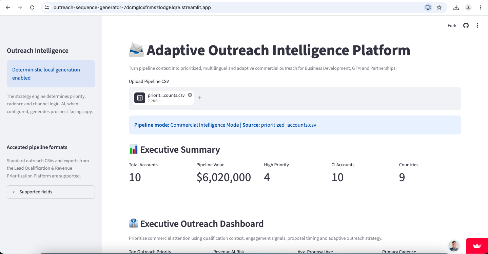
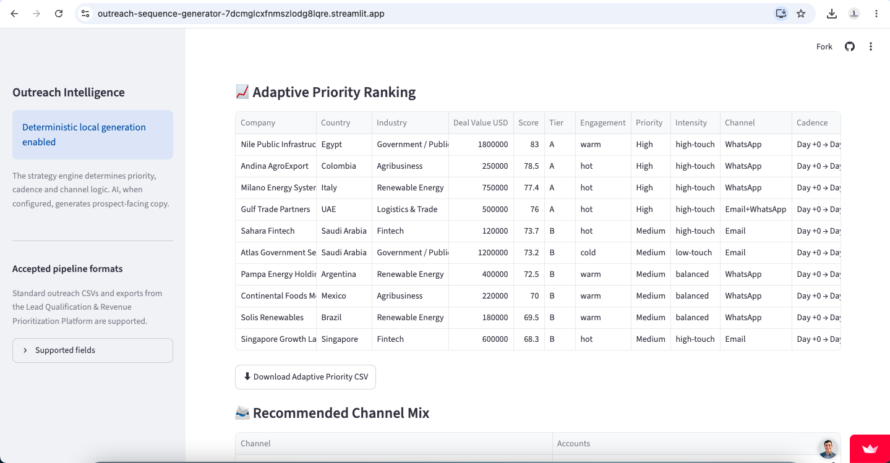
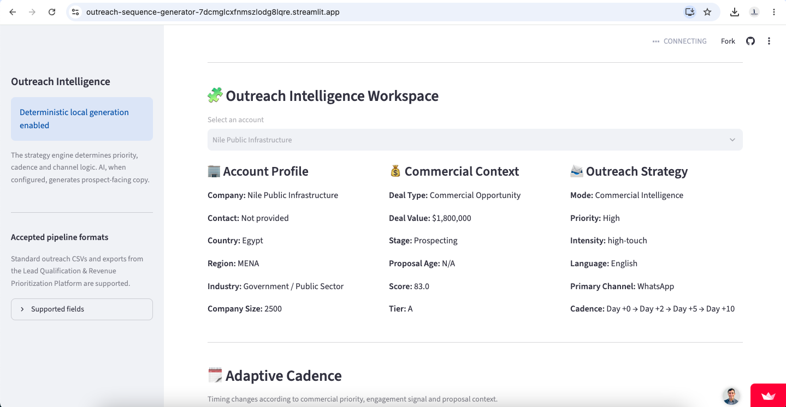
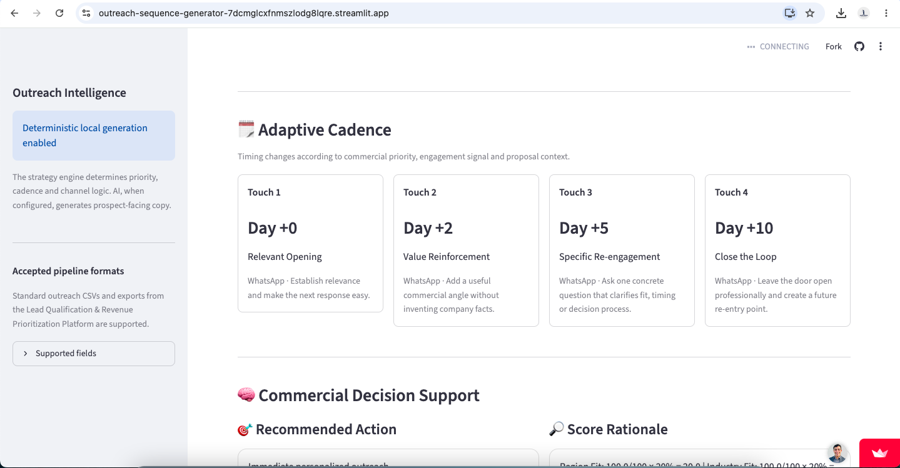
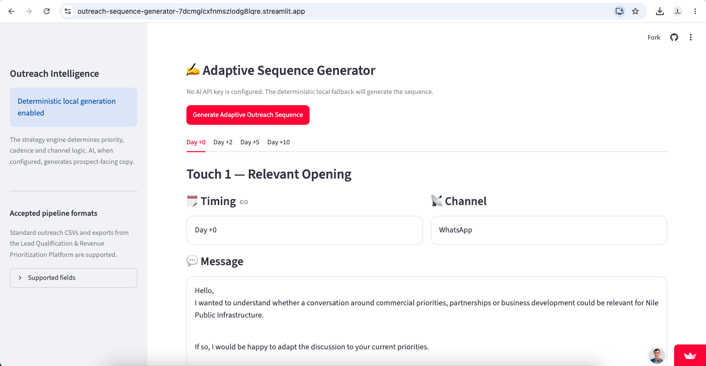

# Adaptive Outreach Intelligence Platform

### Commercial Prioritization | Adaptive Cadence | Multilingual Outreach | AI-Assisted Business Development

[](https://outreach-sequence-generator-7dcmglcxfnmszlodg8lqre.streamlit.app/)


[](https://github.com/Eambrosin/outreach-sequence-generator/actions/workflows/ci.yml)

A practical Commercial Intelligence application designed to help Business Development, Sales, Partnerships and GTM teams determine **who to contact, when to engage, which channel to use and what commercial action should happen next**.

The platform transforms pipeline context into an adaptive outreach strategy using deterministic commercial logic, multilingual communication profiles and an optional AI-assisted message generation layer.

**AI does not determine commercial priority.**

Priority, cadence, channel strategy and outreach intensity are determined by structured commercial rules. AI is used afterward to support prospect-facing message generation.

---

## 🚀 Live Application

[Launch the Adaptive Outreach Intelligence Platform](https://outreach-sequence-generator-7dcmglcxfnmszlodg8lqre.streamlit.app/)

---

## Product Preview

### Executive Outreach Intelligence



Monitor pipeline value, commercial priority, Commercial Intelligence accounts, country coverage and revenue exposure from a single executive view.

---

### Adaptive Priority Ranking



Rank accounts using commercial qualification context, engagement signals, deal value and adaptive outreach logic.

The platform can display:

- Commercial Score
- Priority Tier
- Engagement Signal
- Outreach Priority
- Outreach Intensity
- Recommended Channel
- Adaptive Cadence
- Recommended Commercial Action

---

### Account Intelligence Workspace



Inspect the commercial context of each opportunity before deciding how resources should be allocated.

The workspace combines:

- Account profile
- Deal value
- Pipeline stage
- Proposal age
- Commercial score
- Priority tier
- Engagement signal
- Recommended commercial action
- Communication profile
- Decision risk

---

### Adaptive Outreach Cadence



Outreach timing changes according to the commercial context of each opportunity rather than forcing every account into the same follow-up sequence.

---

### Multilingual Outreach Generation



Generate structured commercial outreach using the account's recommended cadence, communication channel, language and commercial objective.

---

## Business Problem

Commercial teams frequently use the same outreach sequence for very different opportunities.

A high-value, highly engaged Tier A account may receive the same follow-up timing as a low-priority prospect.

This creates several problems:

- High-value opportunities may not receive enough attention
- Low-priority opportunities may consume excessive commercial resources
- Outreach timing may not reflect actual buying signals
- Teams may use the wrong communication channel
- International prospects may receive poorly localized communication
- Qualification data often disappears once outreach begins
- Commercial prioritization and messaging operate as disconnected processes

The result is often more activity without better commercial execution.

---

## Solution

The Adaptive Outreach Intelligence Platform connects commercial qualification with execution.

It converts pipeline information into a structured outreach strategy by determining:

1. Commercial priority
2. Outreach intensity
3. Recommended communication channel
4. Outreach language
5. Adaptive follow-up cadence
6. Commercial objective
7. Recommended next action
8. Prospect-facing outreach sequence

The platform supports both traditional sales pipelines and qualified opportunities exported from the **AI Lead Qualification & Revenue Prioritization Platform**.

---

## Commercial Intelligence Workflow

### Qualify → Prioritize → Engage → Learn → Advance

The broader workflow connects two applications:

```text
Pipeline
    ↓
Lead Qualification
    ↓
ICP Fit
    ↓
Commercial Score
    ↓
Priority Tier
    ↓
Recommended Action
    ↓
Adaptive Outreach Intelligence
    ↓
Priority
    ↓
Cadence
    ↓
Channel
    ↓
Commercial Message
    ↓
Next Step
