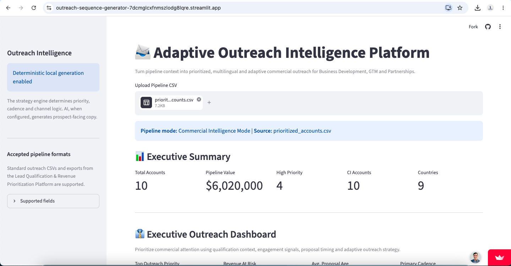
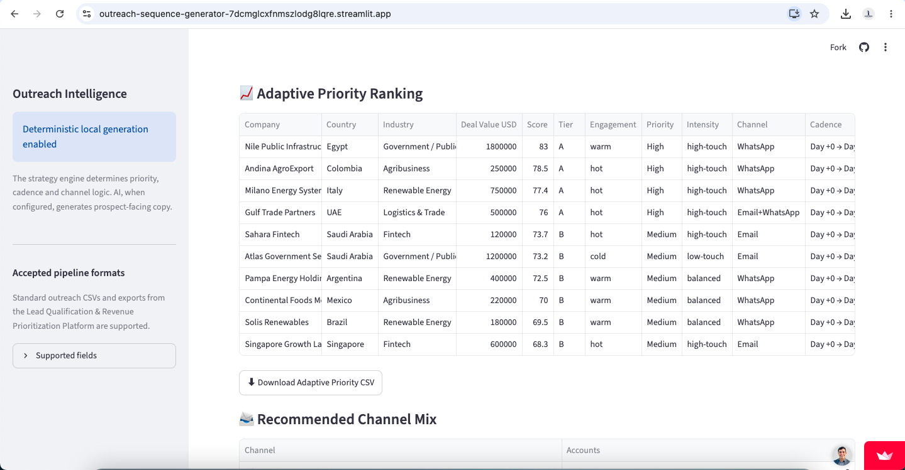
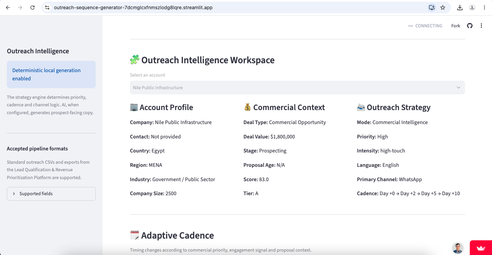
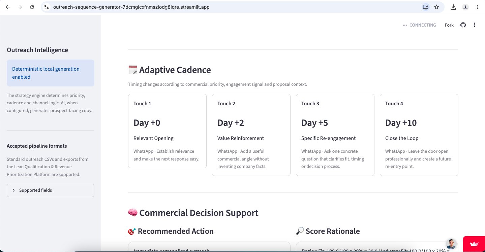
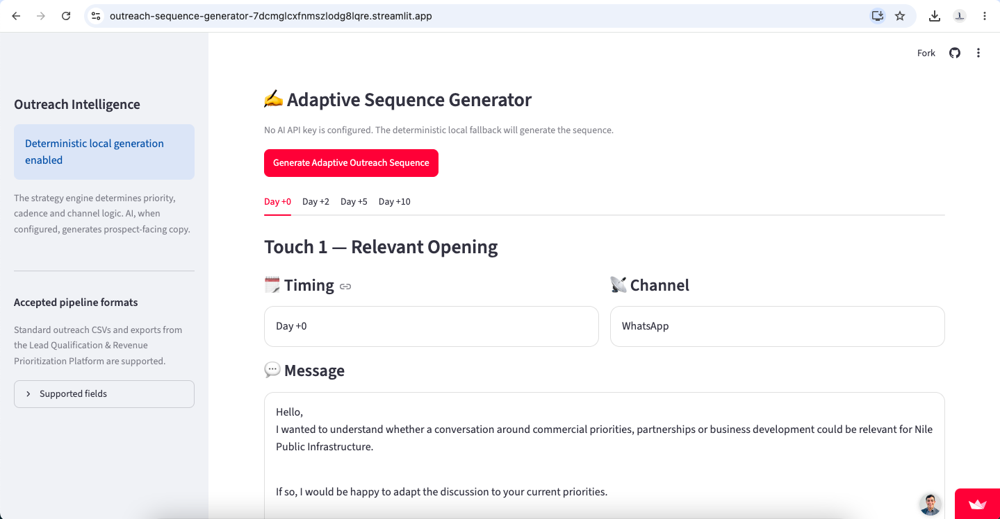

# Adaptive Outreach Intelligence Platform

### Commercial Prioritization | Adaptive Cadence | Multilingual Outreach | AI-Assisted Business Development

[](https://outreach-sequence-generator-7dcmglcxfnmszlodg8lqre.streamlit.app/)


[](https://github.com/Eambrosin/outreach-sequence-generator/actions/workflows/ci.yml)

A practical Commercial Intelligence application designed to help Business Development, Sales, Partnerships and GTM teams decide **who to contact, when to engage, which channel to use and what commercial action should happen next**.

The core strategy is deterministic and explainable. AI is optional and is used only after commercial priority, cadence and channel strategy have already been determined.

> **Commercial logic first. AI assists communication; it does not determine opportunity priority.**

---

## Live Application

[Launch the Adaptive Outreach Intelligence Platform](https://outreach-sequence-generator-7dcmglcxfnmszlodg8lqre.streamlit.app/)

---

## Product Preview

### Executive Outreach Intelligence



Portfolio-level view of pipeline value, commercial priority, country coverage and revenue exposure.

### Adaptive Priority Ranking



Ranks accounts using qualification context, engagement signals, deal value and outreach logic.

### Account Intelligence Workspace



Combines account context, deal value, proposal age, commercial score, priority tier, engagement signal and recommended next action.

### Adaptive Outreach Cadence



Cadence changes according to commercial priority and engagement rather than forcing every account into the same sequence.

### Multilingual Outreach Generation



Produces a four-touch sequence using the selected language, channel, cadence and commercial objective.

---

## Business Problem

Commercial teams frequently use the same outreach sequence for very different opportunities.

That can create several problems:

- high-value opportunities may not receive enough attention
- low-priority accounts may consume excessive time
- follow-up timing may ignore engagement signals
- qualification context may be lost after handoff
- international outreach may not reflect language or channel needs
- internal scoring may leak into prospect-facing communication

The platform connects **qualification context** to **commercial execution**.

---

## Two Operating Modes

### 1. Commercial Intelligence Mode

Designed to consume exports from the [Lead Qualification & Revenue Prioritization Platform](https://github.com/Eambrosin/lead-qualification-scorer).

Supported context includes:

- company and market information
- estimated deal value
- commercial score
- priority tier
- engagement signal
- recommended action
- score rationale

### 2. Standard Outreach Mode

Supports traditional prospecting or post-proposal pipelines even when no upstream score or tier is available.

The deterministic engine can still use:

- proposal age
- engagement signal
- deal value
- country
- communication profile

---

## Decision Logic

The engine determines:

1. commercial priority
2. outreach intensity
3. follow-up cadence
4. primary communication channel
5. outreach language
6. commercial objective
7. recommended next-step structure

Example cadence patterns:

```text
HIGH PRIORITY
Day +0 → Day +2 → Day +5 → Day +10

BALANCED
Day +0 → Day +3 → Day +7 → Day +14

LOW PRIORITY
Day +0 → Day +7 → Day +21 → Day +35
```

Aged post-proposal opportunities receive a different objective focused on clarifying status, surfacing blockers and obtaining a concrete next step.

---

## Channel & Language Profiles

The repository includes configurable country-level defaults for language, channel and tone.

Examples include Portuguese, Spanish, Italian, French, German and English communication profiles.

These profiles are **workflow defaults, not claims about individual behavior or entire markets**. They are intended to be reviewed and adapted by the commercial user before outreach.

For markets not explicitly configured, the application uses a neutral English / Email fallback.

---

## AI Layer

If an `ANTHROPIC_API_KEY` is available, the application can generate prospect-facing messages using the deterministic strategy as context.

The prompt explicitly instructs the model not to expose:

- lead score
- priority tier
- internal priority
- score rationale
- scoring methodology

It also instructs the model not to invent company projects, budgets, decision makers, pain points, growth initiatives or market research.

If AI generation is unavailable or fails, the platform returns a deterministic local sequence instead.

When AI generation is enabled, the selected account context is sent to Anthropic for generation. Users should avoid submitting sensitive personal or confidential information.

---

## Commercial Intelligence Workflow

```text
Lead Qualification
        ↓
Commercial Score
        ↓
Priority Tier
        ↓
Recommended Action
        ↓
Adaptive Outreach Intelligence
        ↓
Priority + Cadence + Channel
        ↓
Prospect-Facing Message
        ↓
Commercial Next Step
```

The objective is to preserve useful commercial context while keeping internal scoring separate from external communication.

---

## Architecture

```text
Pipeline / Lead Export
        ↓
Data Normalization
        ↓
Commercial Priority Engine
        ↓
Adaptive Outreach Strategy
        ↓
Channel + Language Profile
        ↓
┌─────────────────────────────┐
│ Optional AI Message Layer   │
│ or Deterministic Fallback   │
└──────────────┬──────────────┘
               ↓
Four-Touch Outreach Sequence
               ↓
Streamlit Workspace / Export
```

---

## Project Structure

```text
outreach-sequence-generator/
│
├── app.py
├── outreach_generator.py
├── requirements.txt
├── CHANGELOG.md
├── README.md
│
├── data/
│   └── pipeline.csv
│
├── tests/
│   └── test_outreach_generator.py
│
├── .github/
│   └── workflows/
│       └── ci.yml
│
└── screenshots/
```

The commercial strategy engine is separated from the Streamlit presentation layer so the decision logic can be tested independently.

---

## Running Locally

```bash
git clone https://github.com/Eambrosin/outreach-sequence-generator.git
cd outreach-sequence-generator
pip install -r requirements.txt
streamlit run app.py
```

Optional AI generation:

```bash
export ANTHROPIC_API_KEY="your-key"
```

The application works without an API key.

---

## Testing & Continuous Integration

The repository includes automated tests for:

- upstream Lead Qualification compatibility
- commercial-intelligence mode detection
- priority classification
- adaptive cadence
- legacy pipeline support
- prospecting vs post-proposal logic
- unknown-market fallback behavior
- multi-channel sequencing
- protection against exposing internal score context in deterministic messages

Run locally:

```bash
python -m pytest -q
```

GitHub Actions validates Python syntax and runs the test suite on pushes and pull requests to `main`.

---

## Current Version

### v2.0.0

Version 2 connects outreach execution to upstream qualification context while preserving a deterministic local fallback.

See [CHANGELOG.md](CHANGELOG.md) for release details.

---

## Demo Data

The bundled demo pipeline is **synthetic demonstration data**, not a client pipeline or a record of real transactions.

---

## Limitations

This is a portfolio and decision-support application, not a production CRM or automated sales-engagement platform.

Current limitations include:

- no CRM write-back
- no deliverability management
- no contact enrichment
- no automated sending
- country profiles are configurable heuristics rather than empirical market rules
- AI outputs require human review before prospect-facing use

These boundaries are intentional: the project demonstrates structured Commercial Intelligence without presenting itself as a production replacement for established sales platforms.

---

## Portfolio Context

This project is the **ENGAGE** layer of a broader Commercial Intelligence portfolio:

```text
PRIORITIZE
Lead Qualification
      ↓
ENGAGE
Adaptive Outreach
      ↓
PARTNER
Partnership Intelligence
      ↓
EXPAND
Market Entry Intelligence
```

**Portfolio:** [github.com/Eambrosin](https://github.com/Eambrosin)

---

## Author

**Eduardo Ambrosin**  
International Business Development · Strategic Partnerships · GTM · Commercial Intelligence

[LinkedIn](https://www.linkedin.com/in/eduardoambrosin/) · [Professional Website](https://www.ambrosinlegaltrade.com/)
